# Notes on C++

- Stylistically, struct is often used for simple data structures without methods, while class is used for more complex objects with methods and encapsulation.

- `int x = 5;`\
`int x {5};`\
the second one is better because it is safer and doesn’t allow "narrowing conversion", so `int x = 5.1` is ok x will hold 5, but `int x{5.1}` will produce compile-error.

- in maps, if you index a key that does NOT exist (e.g. if(mp[5] == 2)), C++ actually creates that key with value 0.\
if you want to check if a key exists or not, use find function.\
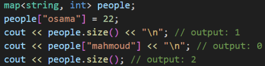

- order: (++, - -, !) -> (*, /, %) -> (+, -) -> (=, +=, -=, …)\
for example: `++x + y/z - t--` \
++x is evaluated, then t--, then y/z.

- `int x;`\
`if(x=1)` -> true, assigning any number returns true\
`if(x=0)` -> false, assigning 0 returns false.

- comma operator evaluates from left to right, and returns the last after-comma result

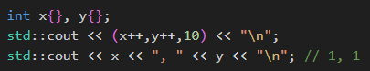

- order of exception handlers (catch statements), if you place a generic handler first, it won't get to the special handler code block. 
    - special handlers first, e.x. catch out_of_range
    - then generic handlers, e.x. catch logical_error

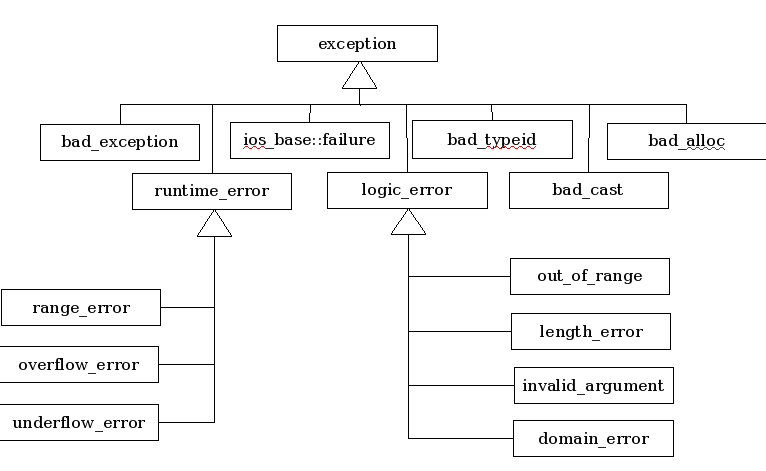

- references work on L-values (and it must be initialized), only case to work on R-values is when u define the reference to be const.\
<code>int x= 10;\
int &x_ref = x; // valid\
int &y_ref = 12; // NOT valid\
const int &z_ref = 15; // valid<code>

- you can NOT change references after initialization (make them aliases for other variables), it will always point to the same mem location.

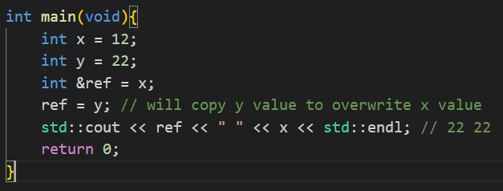

- using inline namespace within a namespace allows this nested namespace functions to be called directly. this would be helpful in developing libraries with different versions.\
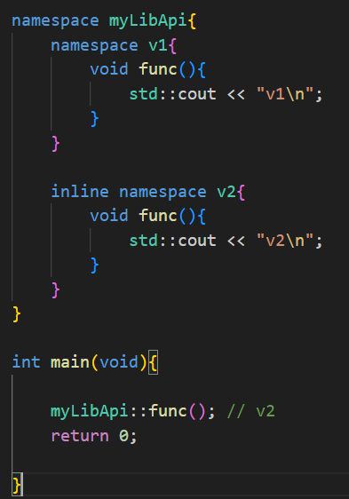

## OOP Notes

- there are 3 types of operators regarding overloading:
    1. operators that can be overloaded inside (member functions) or outside (non-member functions) the class
    2. operators that are only overloaded as member functions (within the class)
    3. operators that can NOT be overloaded at all (like `::`, `.`)

- initializer list is the only way to initialize const member data.
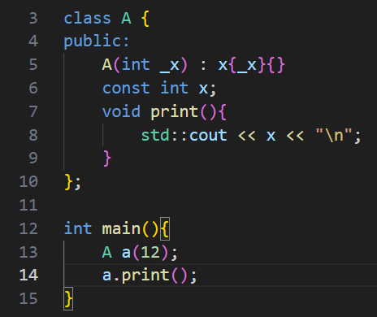

- the slicing problem happens when a derived obj is assigned to a base obj, the derived part is "sliced", as the base object physically has no memory space for the derived members. 
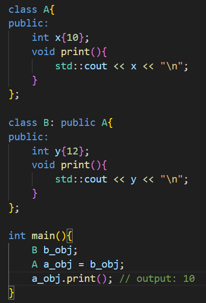

- class const functions can NOT change the class member attributes, and const objects can only call const class functions, so u can only call getters not setters.

- A friend function: a function that is declared outside of a class but has the right to access the class's private and protected members.\
it's NOT a member function, it doesn't have a `this` pointer.\
common use cases: overloading `<<` for stream insertion.

- `class X final {...}`,  "final" prevents inheritance, no class can inherit class X.\
`void do_something() final`, "final" means derived classes can not over-ride this function.

- RAII key concept is to encapsulate resource management within class constructors and destructors. The constructor acquires the resource, and the destructor releases it. Because C++ automatically calls destructors when objects are destroyed, resources are reliably released regardless of how control flow leaves a particular block of code.

- vtable is a static array of -member- function pointers, each class has its own vtable. each object of such a class has a hidden ptr (vptr) that points to the appropriate vtable depending on the object actual (dynamic) type.

- Member function is called based on ptr type (including the destructor) UNLESS base class member function is specified as `virtual`.\
also in the code sample, deleting object `b`, will result in deleting Base object from mem, but Derived object is not deleted, which leads to a memory leak.
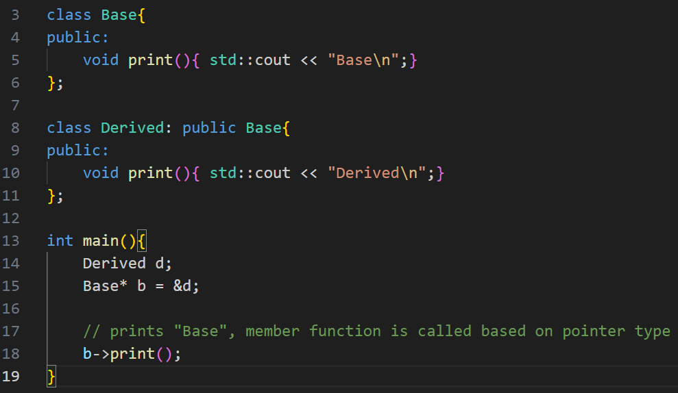

- in this example, the `virtual` keyword in inherited, so what happens is:
    - when u call a member function, we go to ptr type class to call the function.
    - if the member function is virtual, then we go to the actual object class type.
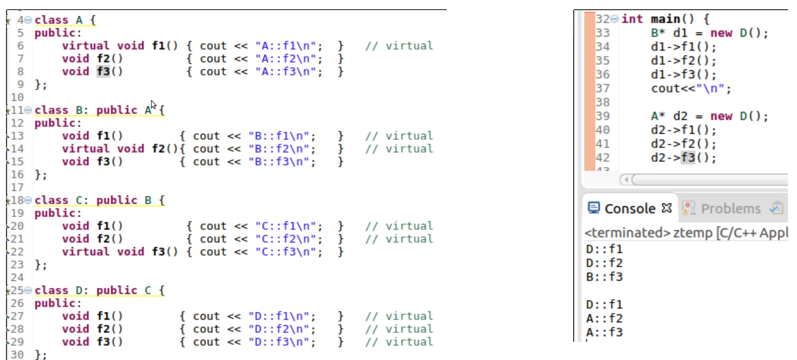

- `override` works only with virtual functions, and it helps catching typos and avoid mistakenly thinking u r overriding a function while u r not.

- u can define implementation of a pure virtual function outside of a class, no errors, but it's useless as derived classes must override.

- to solve the diamond problem, use virtual inheritance.

- set level/limit of abstraction:\
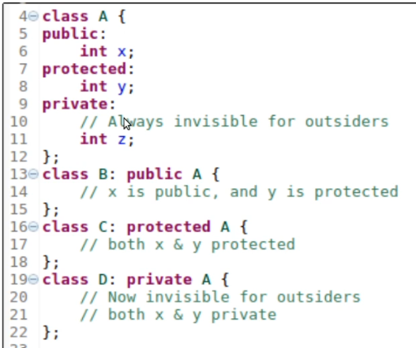

- note that:\
`Object objA;`\
`Object objB = objA; // this is a copy constructor` \
`objB = objA; // this is an assignment operator`

- RVO (return value optimization) is used to eliminate creation of temp objects by directly constructing the object in the mem space of the caller.
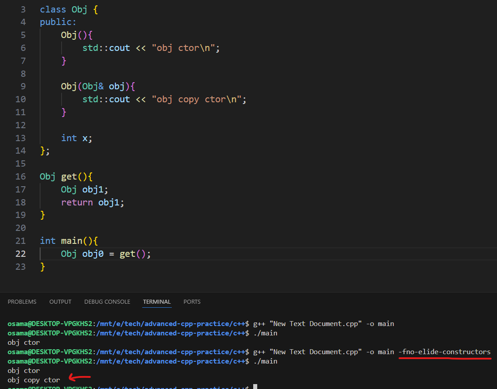

## Smart Pointers
- they're wrappers for raw pointers.
- example of RAII.
### Unique Pointers
- u can NOT copy them, well, they will not be unique if copied.
- u can move them to another unique_ptr (using std::move()), and the original one will be nullptr.
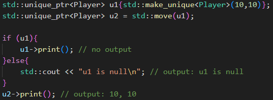

### Shared Pointers
- use them when u need multiple pointers to share ownership of a single dynamically allocated resource.
- can be copied and moved.\
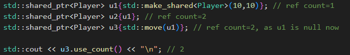

- concept:
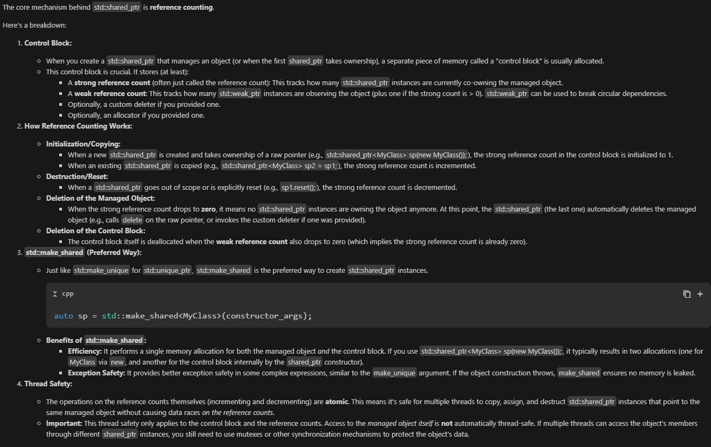note that when strong ref count = 0, the data is deleted, but the control block is not, and it's deleted when both strong ref count and weak pointers count = 0.
### Weak Pointers
- they do NOT participate in ownership of the managed object. This means it doesn't affect the strong reference count that std::shared_ptr uses to determine when to delete the object (or releasing the resource).
- "a pointer that knows when it dangles".
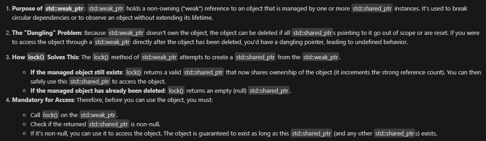
- u can use them in a cache where you want to store pointers to objects (to locate the objects) but don't want the cache itself to keep the objects alive if nothing else is using them.
- u can check if the managed object still exists using the expired() member function.

## Move Semantics
- move semantics: transferring resources/ownership of objects rather than copying them when nobody needs the source values anymore.
- `std::move` does NOT move data itself, it casts/binds the L-value to R-value reference, signaling it's safe to move from this object allowing the compiler to choose the appropriate move constructor if exists.

- Rule of Zero: If your class does NOT directly manage any resources that require special handling during construction, destruction, copy, or move, then you should NOT declare any of the five special member functions:
    - Destructor
    - Copy Constructor
    - Copy Assignment Operator
    - Move Constructor
    - Move Assignment Operator

- Rule of Three: If a class needs to explicitly define any one of the following three special member functions, it almost certainly needs to define all three:
    - Destructor (e.g., to release a resource)
    - Copy Constructor (to correctly copy the resource)
    - Copy Assignment Operator (to correctly assign the resource)

- Rule of Five: This rule extends the Rule of Three. If a class needs to explicitly define any one of the five special member functions (or if you define a destructor, which suppresses implicit generation of move operations), it probably needs to define (or explicitly =default or =delete) all five:
    - Destructor
    - Copy Constructor
    - Copy Assignment Operator
    - Move Constructor (for efficient resource transfer from temporary objects)
    - Move Assignment Operator (for efficient resource transfer during assignment from temporary objects)

- types of values:
    - l-value: have a mem location (has identity)
    - r-value: temporary values
    - gl-value: generalized l-values
    - pr-value: pure r-value, temporary, no identity, used to initialize or pass.
    - x-value: expiring value, an object whose resources can be reused (via std::move(x)).

- using T&& binds to r-values, lets u overload functions to handle temporaries differently from l-values.
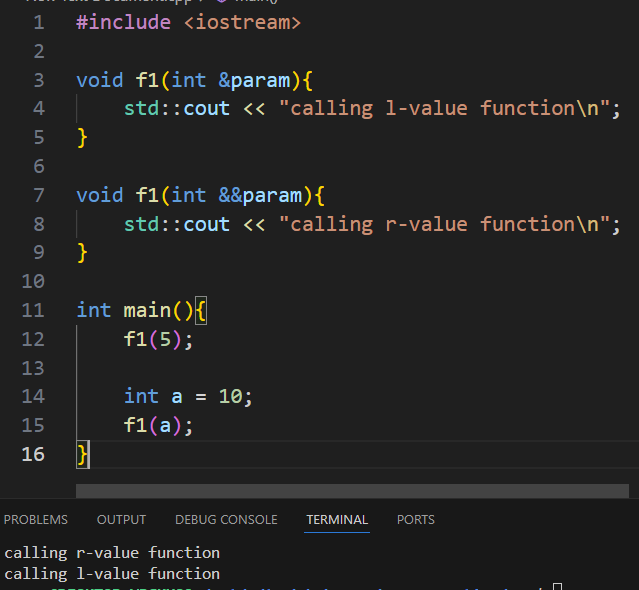

## Comparisons
| Compile-time polymorphism (static binding) | Runtime polymorphism (dynamic binding)| 
| --- | ---| 
Achieved through function/operator overloading and templates. | Achieved through virtual functions and inheritance. |
The compiler determines which function to call at compile time. | The function to call is determined at runtime based on the object's actual type.
---
| exception | error code (return values)|
| ---|---|
| unexpected errors and difficult to be handled by caller|expected errors and can be handled by caller.|
---
| virtual methods |pure virtual methods|
|---|---|
|It allows derived classes to override the base class implementation. If a derived class does not provide its own implementation, the base class version is used.| it has no implementation (it's declared with = 0). It makes the base class an abstract class, meaning you cannot create instances of the base class directly. Derived classes must provide an implementation for the pure virtual method|
|`virtual void do_something() {...}`|`virtual void do_something() = 0;`|
---
|`new`|`malloc`|
|---|---|
|c++ operator|c function|
|return a ptr of the object's type (type-safe)|return ptr to void|
|can call constructors|allocate raw memory|
|can be overloaded|can NOT be overloaded|
---
|static cast|dynamic cast|
|---|---|
|usual casting, similar to c-style casting| safely navigating inheritance hierarchies at runtime
check happens at compile-time|check happens in run-time|
|not safe for downcasting|primarily used for downcasting (from base class to derived class), return nullptr if fails|
---
|L-values (&)|R-values (&&)|
|---|---|
|Represents an object that occupies identifiable location in memory|Represents a temporary value that does not necessarily have a persistent memory location|
|examples: variables, dereferenced ptrs, array elements, Function calls that return by l-value reference|numbers, Temporary objects/results of expressions, Function calls that return by value|
|can be assigned to|can NOT be assigned to|
|Persist beyond the expression they are part of|temporary|

---
|Stack|Heap|
|---|---|
|used for local vars, function params|used for dynamic mem allocation|
|de/allocation is done automatically when entering/exiting scope|de/allocation is done manually (new/malloc/delete/free)|
|each thread has its own stack|all threads share the heap|
|||
## Tips
- create your own copy constructor when dealing with pointers and heap memory, to avoid multiple objects pointing to the same heap, if used.
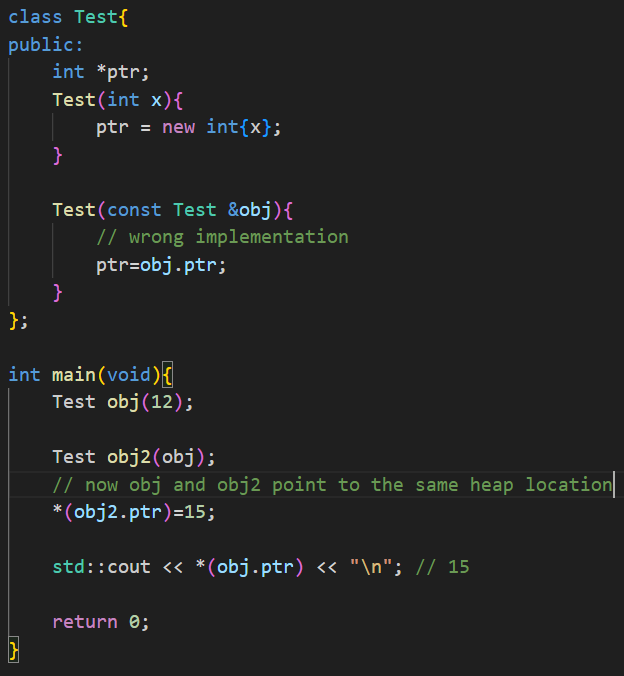
- to detect and prevent mem leak: code-review, degubbing tools, use smart pointers.
- `reinterpret_cast` is extremely unsafe, and use `const_cast` carefully!
- destructors should be virtual in base classes, for proper clean-up of resources in child classes. 

## Advanced (or misc)
- replacement new: allows you to construct an object at a specific, pre-allocated memory address. Unlike the standard new operator, placement new does not allocate memory itself; it only calls the constructor of the object to initialize it in the provided memory location. You need to free the space by yourself.