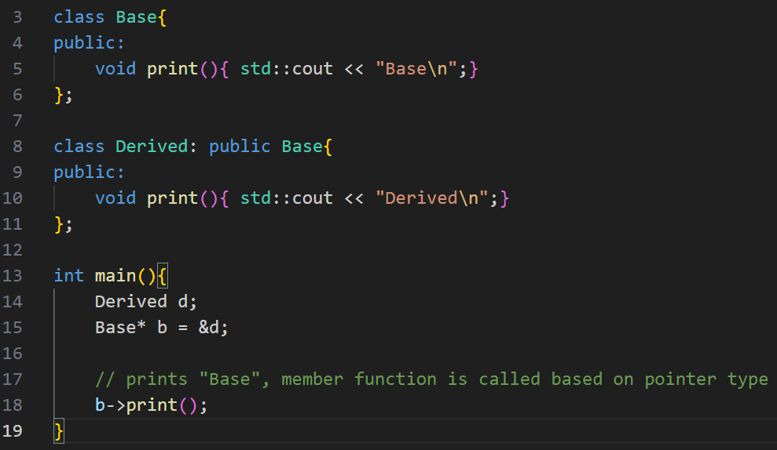
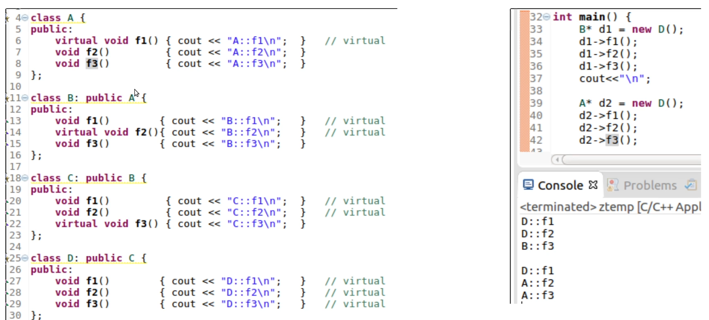
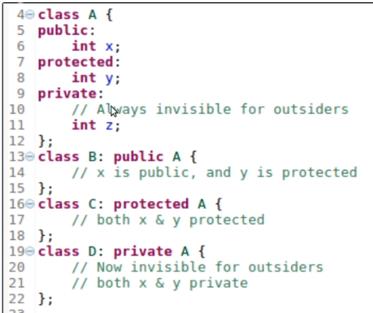
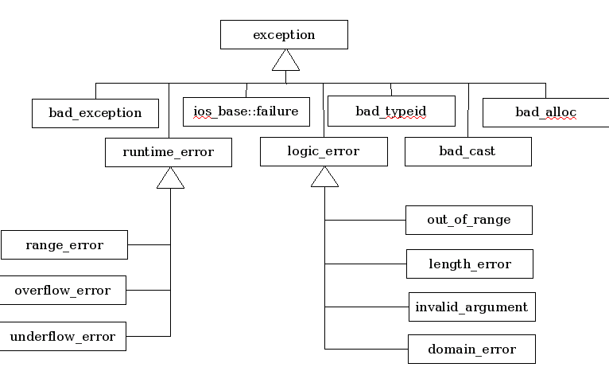

# Notes on C++

- Stylistically, struct is often used for simple data structures without methods, while class is used for more complex objects with methods and encapsulation.

- A friend function: a function that is declared outside of a class but has the right to access the class's private and protected members.\
it's NOT a member function, it doesn't have a `this` pointer.\
common use cases: overloading `<<` for stream insertion.

- `class X final {...}`,  "final" prevents inheritance, no class can inherit class X.\
`void do_something() final`, "final" means derived classes can not over-ride this function.

- RAII key concept is to encapsulate resource management within class constructors and destructors. The constructor acquires the resource, and the destructor releases it. Because C++ automatically calls destructors when objects are destroyed, resources are reliably released regardless of how control flow leaves a particular block of code.

- Member function is called based on ptr type UNLESS base class member function is specified as `virtual`.\
also in the code sample, deleting object `b`, will result in deleting Base object from mem, but Derived object is not deleted, which leads to a memory leak.

in this example, the `virtual` keyword in inherited, so what happens is:
    - when u call a member function, we go to ptr type class to call the function.
    - if the member function is virtual, then we go to the actual object class type.

- set level/limit of abstraction:\

- order of exception hanndlers (catch statements), if you place a generic handler first, it won't get to the special handler code block. 
    - special handlers first, e.x. catch out_of_range
    - then generic handlers, e.x. catch logical_error

- there are 3 types of operators regarding overloading:
1. operators that can be overloaded inside (member functions) or outside (non-member functions) the class
2. operators that are only overloaded as member functions (within the class)
3. operators that can NOT be overloaded at all (like `::`, `.`)

- `Object objA;`\
`Object objB = objA;` --> this is a copy constructor \
`objB = objA;` --> this is an assignment operator.

| Compile-time polymorphism (static binding) | Runtime polymorphism (dynamic binding)| 
| --- | ---| 
Achieved through function/operator overloading and templates. | Achieved through virtual functions and inheritance. |
The compiler determines which function to call at compile time. | The function to call is determined at runtime based on the object's actual type.
---
| exception | error code (return values)|
| ---|---|
| unexpected errors and difficult to be handled by caller|expected errors and can be handled by caller.|
---
| virtual methods |pure virtual methods|
|---|---|
|It allows derived classes to override the base class implementation. If a derived class does not provide its own implementation, the base class version is used.| it has no implementation (it's declared with = 0). It makes the base class an abstract class, meaning you cannot create instances of the base class directly. Derived classes must provide an implementation for the pure virtual method|
|`virtual void do_something() {...}`|`virtual void do_something() = 0;`|
---
## Tips
- create your own copy constructor when dealing with pointers and references.
- to detect and prevent mem leak: code-review, degubbing tools, use smart pointers.
