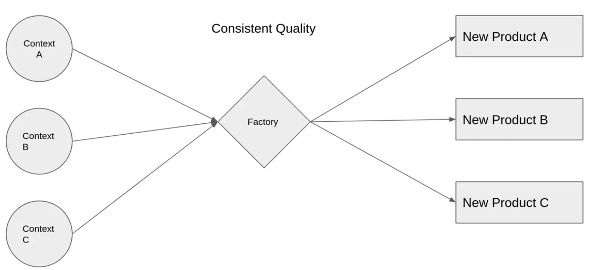
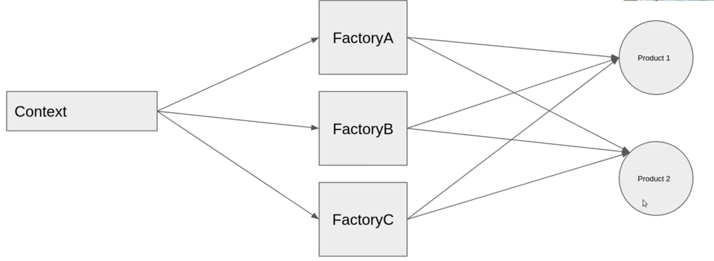
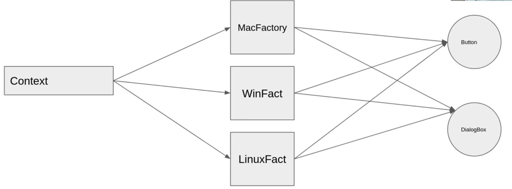

# Quick Notes on Design Patterns

## Creational: mechanism of creating new objects

### Singleton: 
only 1 instance of an object running.

### Factory: 
Abstracting contexts of how to create the objects.
- **1 factory creates all products.**
- The factory is the one who knows what are the available products and how to make them.
- modifying list of available products and how to make them happens only in the factory, instead of each context.

### Abstract Factory: 
multiple factories create the same products.
- **multiple factories creates all products.**
- in a cross-platform application example, if the app is launched from Windows, then it will call WinFact, as i'm only interested in Windows factory.

***
## Structural

### Decorator: 
dynamic customization pattern.

### Adapter
### Proxy
### Flyweight:
many objects share the same characteristics (intrinsic data)

***
## Behavioral: communication between objects

### Observer: 
notifications pattern.

### Strategy: 
different algorithms to perform the same task.

### Memento: 
checkpoints pattern (saving different states of an application).

### Template: 
blueprint for a set of algorithms/receipes that differs in 1-2 steps in the process.

###  Chain of Responsibility