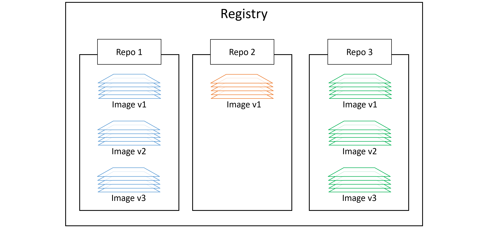
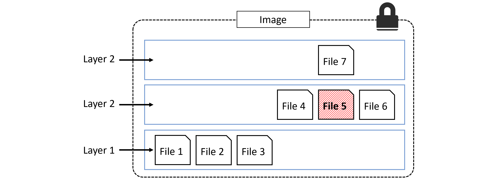
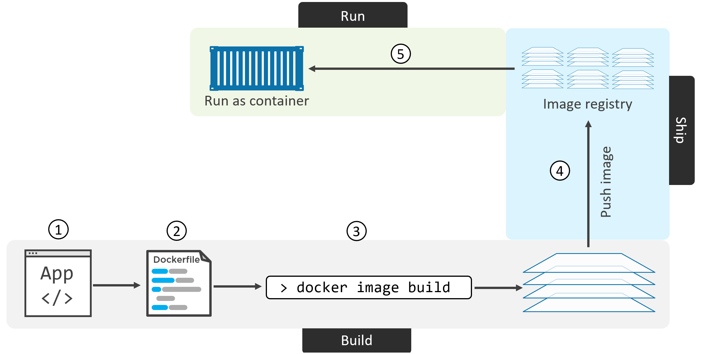
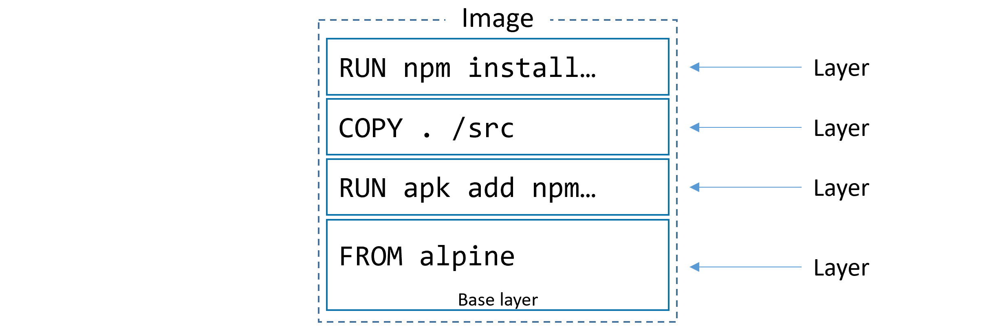
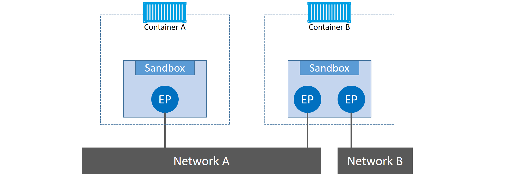
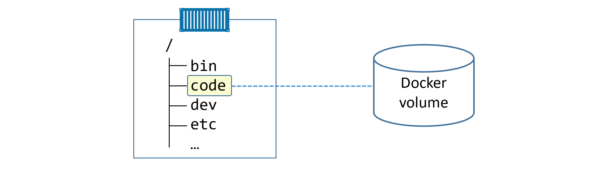
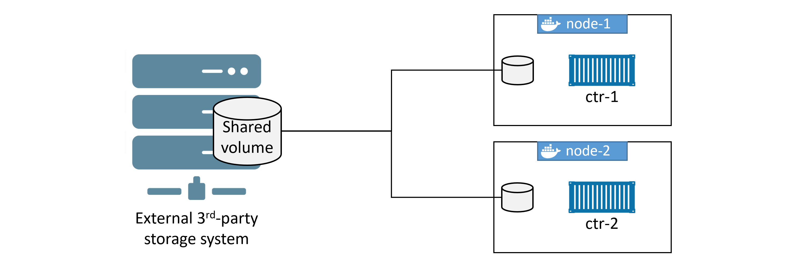

# Docker Notes
credits to Eng. Ahmed Sami, owner of Big Data بالعربي YouTube channel.

# Containers vs Virtual Machines
| Virtual Machine Architecture | Container Architecture |
|-|-|
| Requires full guest OS| Shares host OS kernel (potential security concern)|
| Hardware-level virtualization| OS-level virtualization|
| Managed by hypervisors| Managed by container runtime|
| Higher resource requirements| Lightweight resource footprint|
| Complete isolation with dedicated kernel| Process-level isolation|
| better for multi-tenant environments | ideal for microservices |
| virtualization overhead | near-native performance |
| take minutes to boot | start in seconds |

# The Docker Engine

## Detailed Arch

### **`runc`**

- CLI wrapper  
- Only creates containers
- Standalone container runtime tool

### **`containerd`**

- Backgroud process (`$ ps -elf | grep containerd`)
- Manage container lifecycle(`start | stop | pause | rm ...`)
- Image pulls, volumes, networks, etc.

### Starting a new container process

### One huge benefit of this model
- Container runtime is decoupled from the Docker daemon: "daemonless containers"  
- You can perform maintenance and upgrades on the Docker daemon without impacting running containers

### What’s this shim all about?
- Reduced version of `containerd` that remains running after `runc` exists after creating the container  
- STDIN and STDOUT streams remain open even after the daemon is restarted  
- Reports container status to daemon

### Securing client and daemon communication

Locally over IPC sockets, over the HTTP socket call on port `2375/tcp`

# Images
- A unit of packaging that contains the application + everything required for an application to run:
  - Application code
  - Application dependencies
  - OS Constructs

- Get an image by "Pulling" it from a registry. By default Docker Hub is used
- Consists of layers stacked on top of each other.

- Images are considered build-time constructs where containers are runtime constructs.

## Image Registries
- Images are stored in centralized places called _image registries_.  
- The most common registry is "Docker Hub".
- Other 3rd party registries and local registries can also be used.
- Image registries contain one or more _image repositories_. Each repo can have one or more versions of the image.

## Images and layers

- A Docker image is a bunch of loosely-connected read-only layers.  
- Each layer is one or more files.

- All Docker images start with a _base layer_  
- New layers are added on top as new content is added to the image

Example:\
Create a Python application on top over ubuntu 20.04 then some source code is added

**Docker uses a _storage driver_ in order to stack and merge all layers and present them as a single image.**  
- `AUFS`, `overlay2`, `devicemapper`, `btrfs` and `zfs` for Linux
- `windowsfilter` for Windows NTFS.

### Sharing image layers

Multiple images can, and do, share layers. This leads to efficiencies in space and performance.

when u pull an image that has layers that already exists for other downloaded images, these layers are not downloaded.

### A little bit more about image hashes (digests)

- The image itself is a configuration file that lists the layers and some metadata.
- The _layers_ are where the data lives (files, codes, etc.).
- Each layer is independent.
- When pushing or pulling an image docker compresses the image to save network bandwidth - But this changes the hashes.

### Multi-architecture images

- Windows and Linux, on variations of ARM, ARM 64, IBM Z, IBM POWER, x64, PowerPC, and s390x.
- A single image tag supporting multiple platforms and architectures.
- To make this happen, the Registry API supports two important constructs:
    - **`manifest lists`**
    - **`manifests`**

1. When pulling the image, the Docker client makes a call to the Docker Registry API exposed by Docker Hub.
2. Docker Registry API inspect the platform/Arch of the calling docker client.  
3. If a **manifest list** exists for the image it will be parsed to see if there's a **manifest** for the calling client.
4. If a **manifest** exists the API will retrieve the layers in it.

# Containers

## Docker containers

- A container is the runtime instance of an image.
- Instead of running a full-blown OS like a VM, containers share the OS/kernel with the host they’re running on.
- A single Docker image can be used to start multiple Docker containers.

### Containers vs VMs

- VMs Architecture
- Hypervisors perform hardware virtualization — they carve up physical hardware resources into virtual versions called VMs.

- Containers Architecture
- Containers perform OS virtualization — they carve OS resources into virtual versions called containers.

### Container processes

- `/bin/bash` is the only process running in the container, hence if you run `exit` it will exit and terminate the container.
- **killing the main process in the container will kill the container**

### Container lifecycle
1. Create
2. Start
3. Run
4. Pause/Unpause
5. Stop
6. Restart
7. Kill
8. Remove

### Stopping containers gracefully

- `docker container stop` sends a **SIGTERM** signal to PID(1)
- If the process doesn't exit in 10 sec it sends a **SIGKILL** signal

### Self-healing containers with restart policies

Restart policies are applied per-container, and can be configured imperatively on the command line as part of `docker container run` commands, or declaratively in YAML files.

**`restart: no`**: Default, never automatically restart

**`restart: always`**  
container will always restart if the main process is killed from inside the container but won't restart if you manually stopped it. Will restart if the Docker daemon restarts.  
**`restart: unless-stopped`**  
container will always restart if the main process is killed from inside the container but won't restart if you manually stopped it. However will NOT restart if the Docker daemon restarts.  
**`restart: on-failue`**  
container will always restart if the main process exits with non-zero code (i.e. with error) but won't restart if you manually stopped it. However will restart if the Docker daemon restarts.  

# Containerizing an App

It's the process of taking an application and configuring it to run as a container.

The process of containerizing an app looks like this:

1. Start with your application code and dependencies
2. Create a _Dockerfile_ that describes your app, its dependencies, and how to run it
3. Feed the _Dockerfile_ into the `docker image build` command
4. Push the new image to a registry (optional)
5. Run container from the image

## Inspecting A Sample Dockerfile

1. All Dockerfiles start with the `FROM` instruction. This will be the base layer of the image, and the rest of the app will be added on top as additional layers.

2. Next, the Dockerfile creates a `LABEL` that specifies “nigelpoulton@hotmail.com” as the maintainer of the image

3. The `RUN apk add --update nodejs nodejs-npm` instruction uses the Alpine `apk` package manager to install `nodejs` and `nodejs-npm` into the image.

4. The `COPY . /src` instruction creates another new layer and copies in the application and dependency files from the _build context_.

### Build Context
- Directory containing Dockerfile and referenced files
- Sent to Docker daemon during build
- Exclude files with `.dockerignore`

5. Next, the Dockerfile uses the `WORKDIR` instruction to set the working directory inside the image filesystem for the rest of the instructions in the file

6. Then the `RUN npm install` instruction creates a new layer and uses `npm` to install application dependencies listed in the `package.json` file in the build context.

7. The application exposes a web service on TCP port 8080, so the Dockerfile documents this with the `EXPOSE 8080` instruction.

8. Finally, the `ENTRYPOINT` instruction is used to set the main application that the image (container) should run. This is also added as metadata and not an image layer.

Docker needs the following information when pushing an image:
- Registry
- Repository
- Tag

The `tag` should include the `repository` name (your user account on Docker Hub):  

## Squashing the image (not a good practice)
Squashing an image means that after building the image all layers will be merged(squashed) into a single layer.

# Deploying Apps with Docker Compose

## Docker Compose
it's is a tool for defining and running multi-container applications, where one or more containers run a service (services like: Authentication, Authorization, Logging, Database, etc..) 

Key Features:
- Define services in a YAML file
- Start all services with a single command
- Manage application lifecycle
- Share environment variables
- Create named volumes and networks

## Compose files
- Compose uses YAML files to define multi-service applications. 
- YAML is a subset of JSON, so you can also use JSON. 
- The default name for a Compose YAML file is `docker-compose.yml`.\
Four top-level keys:
  - version
  - services
  - networks
  - volumes

- sample compose file:
  - The multi-container app defined in a Compose file is called a _Compose app_.
  - start, stop, delete, and get the status of applications being managed by Docker Compose
>>> 

# Docker Networking
Communication between containers

### Network Types
1. Bridge: Default network driver for containers on single host
2. Host: Removes network isolation between container and host
3. Overlay: Connects multiple Docker daemons for swarm services
4. Macvlan: Assigns MAC addresses to containers for physical network appearance
5. None: Disables networking

## The theory
- Docker networking is based on open-source Container Network Model (CNM).
- `libnetwork` is Docker's implementation of CNM.
    - single-host bridge networks
    - multi-host overlays
    - plugins for existing VLANs
    - native service discovery
    - basic container load balancing

Docker networking components:
- The Container Network Model (CNM)
- libnetwork
- Drivers

### The Container Network Model (CNM)

CNM Building Blocks:
- **Sandboxes**: an isolated network stack. It includes; Ethernet interfaces, ports, routing tables, and DNS config.
- **Endpoints**: virtual network interfaces responsible for making sandboxes connect to networks.
- **Networks**: software implementation of a switch (802.1d bridge)

## Single-host (Bridge) networks

- **Single-host**: only exists on a single Docker host and can only connect containers that are on the same host.
- **Bridge**: implementation of an 802.1d bridge (layer 2 switch).

All new containers will be connected to this default network unless `--network` flag is used.

The default “bridge” network, on all Linux-based Docker hosts, maps to an underlying _Linux bridge_ in the kernel called **“docker0”**  

## Port Mapping

Containers connected to bridge networks cannot communicate outside it except in the case of _Port Mapping_

`$ docker container run -d --name web --network localnet --publish 5000:80 nginx`

# Docker Swarm
>>>

- In Docker Swarm, a container running on a standalone host that is part of the Swarm cluster will not be visible or monitored by the Swarm manager unless that container is part of the Swarm service. Here’s why:
    1. Swarm Mode: Docker Swarm is designed to manage services that run across a cluster of Docker nodes. When you initialize a Swarm and join nodes, Docker Swarm manages services by creating tasks (containers) that run on the worker nodes based on the declared service configuration.
    2. Standalone Container: If you run a container directly on a node without using Swarm to orchestrate it (i.e., by using docker run instead of deploying it as a service with docker service create), Docker Swarm won't be aware of it. The container is not part of a Swarm-managed service, and hence the Swarm manager won't monitor or track it.
- When updating a docker swarm, it stops [not removes, to allow rolling-back] the old-version containers 1 by 1 (unless configured with --update-parallelism flag), and starts new containers.

## Service discovery
_Service discovery_ allows all containers and Swarm services to locate each other by name.

_service discovery_ is network-scoped. This means that name resolution only works for containers and Services on the same network

## Ingress load balancing (only with Swarms)
>>>

## Docker Stack
- docker-compose is a way to automate creating multiple containers with a single file
- docker-stack is a way to automate creating multiple services with a single file

# Volumes

## Storage Types
1. Volumes: Managed by Docker in `/var/lib/docker/volumes/`
2. Bind Mounts: File/directory on host filesystem
3. tmpfs Mounts: Stored in host memory only

## Containers and non-persistent data
- Containers are designed to be immutable
- many applications require a read-write filesystem in order to simply run – they won’t even run on a read-only filesystem.
- Every Docker container is created by adding a thin read-write layer on top of the read-only image it’s based on
- The writeable layer is called many names: local storage, ephemeral storage, and graphdriver storage.
- **a volume gets created when the container is created and it gets deleted when the container is deleted**
- Managed on Docker host using a storage driver (Ubuntu: `overlay2` or `aufs`. `overlay2` is recommended)

## Containers and persistent data

- Volumes are the recommended way to persist data in containers.
- Volumes are independent objects that are not tied to the lifecycle of a container
- Volumes can be mapped/mounted to specialized external storage systems
- Volumes enable multiple containers on different Docker hosts to access and share the same data.

1. Create a volume
2. Create a container 
3. Mount the volume into it 
4. The volume is mounted into a directory in the container’s filesystem
5. Anyhing written to that directory is stored in the volume
6. **If you delete the container, the volume and its data will still exist.**

### Creating and managing Docker volumes

### Sharing storage across cluster nodes

# General Notes
- In docker services, "service converged" means the service is in the desired states: n number of containers are running for example, but this doesn't mean that apps in these containers are running successfully.\
e.g. a service has a container for the database, the container itself is running, but the app (database) might be down/in-accessible. \
docker swarm sees that all is ok as long as the container is up & running.

- In docker services, if any desired state can not be met, then the service is NOT converged, and docker swarm will keep trying to meet these desired states.\
desired states examples: service is connected to a specific network, a service has a specific n replicas, etc..

- Portainer is a web-based GUI for managing and monitoring docker environments (services/containers/stacks/images/networks/volumes/etc..).

- 'etcd' is a distributed key-value store/database used to hold and manage the information (like configuration data, state data, and metadata) that distributed systems need to keep running.

- in Docker, the base unit is a container, a group of containers is a swarm.\
in K8s, the unit is a pod (which is a group of 1 or more containers), a group of pods is a deployment.