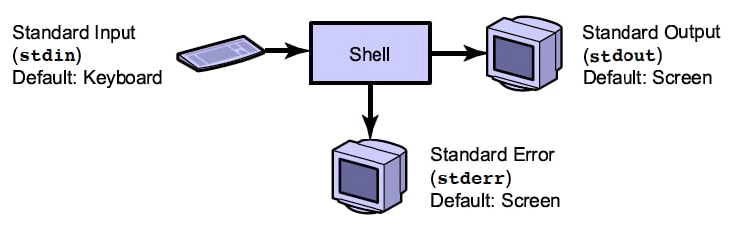
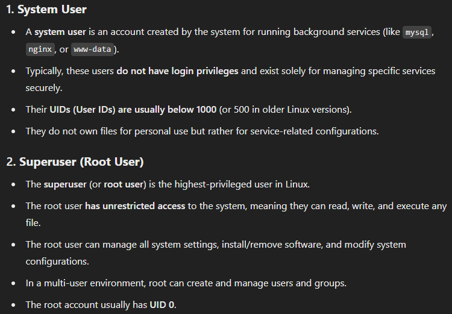
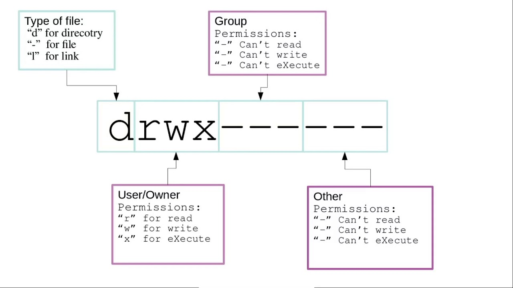
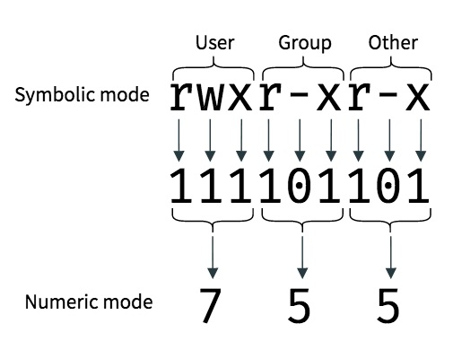
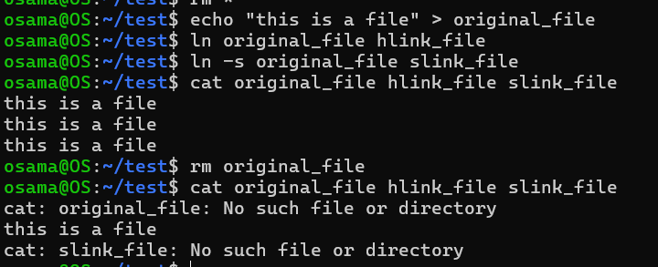
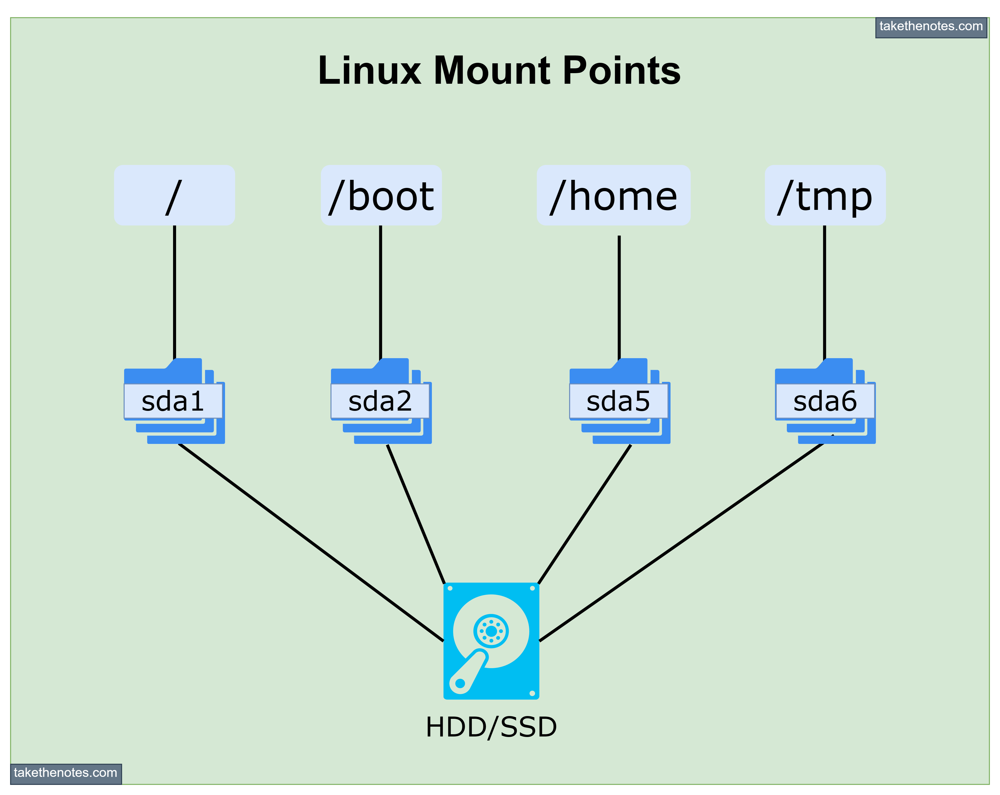
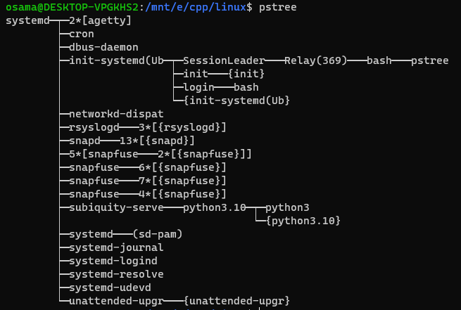

# Linux Notes

## Redirection
stdin has index 0\
stdout has index 1\
stderr has index 2.\
so, to redirect stdout use > (same as 1>),\
and to only redirect stderr, use 2>.

## Users, Groups and Permissions
there r 3 types of users:
1. normal user (a human)
2. super user
3. system user

the diff between super and system users:

> > > 

- if a user is not listed in the sudoers file, they will not have permission to execute commands with sudo.\
The sudoers file (/etc/sudoers) controls which users or groups have the ability to run commands with elevated (root) privileges.
- when adding a user, when setting a password using -p option, the password will be set as plain text in /etc/shadow. use -p to set an initial password that the user themselves shall update later.
- when a user account is created, a group is typically created with the same name as the user account. This group is often referred to as the user's private group. This behavior is part of the default configuration for most Linux distributions, especially those that use the useradd command to create new users.\
For example, if you create a user called john, Linux would create a group called john, and that group would be the primary group for the user. This practice is known as user private groups (UPG), and it provides the advantage of making each user's files belong to their own group by default, helping to improve security and file management.
- /etc/passwd: contains list of users (users database).
- /etc/group: contains list of groups along with members in each group.

### Permission
permissions (r/w/x) meaning differ for file and directories:
- for files:
    - r: allows to read the file (read file contents).
    - w: allows modifying the file (edit, delete, or truncate).
    - x: allows executing the file as a program/script.

- for dirs:
    - r: allows listing the contents of the directory (ls command).
    - w: allows creating, renaming, or deleting files within the directory.
    - x: allows entering the directory (cd command) and reading metadata of files inside (even if r is not set).
 
to view file modes: `ls -l`
>>> 

### Related-Commands
- useradd, userdel: add/remove users
- passwd: change password for a user or for the root.
- su: switch user
- usermod: modify user info, add the user to a specific group, etc.
- groupadd, groupdel: add/remove groups
- chown: change file/dir ownership (owner user and/or group).
- getfacl/setfacl: get/set file access control list, to add special permissions for users in 'other' (not in the file owner group).
- chmod: change file modes (permissions), you can specifiy permissions on rwx form, or a numerical form {r:4, w:2, x:1}.\
eg: `chmod u=rwx,g=r--,o=--- file1`, or `chmod 740 file1`.

>>> 

## File Management
- an inode (Index Node) is a data structure used to store metadata about a file or directory. It contains information that describes the file itself - but not the file's name or its actual content. an inode contains:
    1. File Type: Whether the file is a regular file, directory, symbolic link, etc.
    2. File Permissions: Information about who can read, write, or execute the file (file access permissions).
    3. Owner and Group: The user ID (UID) and group ID (GID) of the file's owner.
    4. File Size: The size of the file in bytes.
    5. Timestamps:\
        5.1. Creation time\
        5.2. Modification time: The last time the file's content was modified.\
        5.3. Access time: The last time the file was accessed.\
        5.4. Change time: The last time the inode's metadata was modified.
    6. Link Count: The number of hard links that refer to the inode (i.e., the number of filenames pointing to the file).
    7. Pointers to Data Blocks: Addresses of the actual data blocks that store the content of the file. 

- When a file system is created, the number of inodes is fixed. If the inode table gets exhausted (i.e., too many files are created), no more files can be created, even if there is free space available on the disk.

### Links
- hard links: create a new filename pointing to the same inode and datablocks (think of it as a box [inode] with 2 tags [filenames] on it).
- soft/symbolic links: create a new file that points to the original filename, not the inode or datablocks, so it create a new inode.

- modifying the original file will reflect in both links.
- when deleting the original file, the hard link will be safe (as deleting doesn't remove the datablocks, but it marks them as free), but the soft link will be useless. 
 
> > > 

### Mounting
there's an abstraction between the file system, and the physical storage, so for example, NOT all dirs in root (/*) must exist in the same physical disk or partition where the root it.\
e.g. home dir might be sda5, and its sub dirs might be in sda2 and sda6!

### File Archive & Compression
- 'tar' for tape archive, gzip/gz for gun zip.
- u can archive multiple files or a dir into 1 file, with or w/o compression.
- u can list contents of an archive file without extraction.
- there are many compression algos, like gzip and bzip2, gzip is overall faster, but bzip2 produces smaller archives (space-time tradeoff)

### Related-Commands
- stat <file>: display info about the file, including inode info and the inode id.
- ln: create a soft/hard link to a file.
- tar
- gzip
- file: get type of a file.

## Linux Processes
- the main & top-most process in linux is init (or systemd in modern systems), which is the first process started by the kernel after booting. It has PID 1, and is responsible for initializing the system, managing services, and handling system shutdown.
- some processes ends with 'd' like systemd, the letter 'd' is for daemon, which is any process (user/kernel) or service running in background.

- to run a command in the background, just add ' &' after typing the command, this will run it in a new job.

### Related-Commands
- ps: view a snapshot of running processes, -e to list all processes.
- pstree: view processes tree for better visualization.
- htop: real-time info about running processes, cpu load, mem usage, etc.
- jobs: view background running jobs/commands.
- fg: move backfround jobs to foreground.
- kill: terminate a process by its PID, it sends a signal to the process, there are several termination signals, default is SIGTERM (value:15), if the process is not terminated, kill it with the most powerful signal, SIGKILL (value:9).
- systemctl: manages the systemd system, and lets u control (list, start/stop, restart, enable/disable, and check the status) the services and units.

## General Notes
- u can execute shell commands while in vim, the shell command output will be written to the file, :.!<command>

- ~/.bashrc is called/executed for both login & non-login shells.

- terminals differs from each other in things like color coding, auto-completion, font size,
but shells differs from each other in performance, built-in commands, pipelining, etc..

## General Commands
- wc: word count in a file, it counts lines, words and chars.
- grep: searching in plaintext.
- find: searching for files in a dir. 
- head,tail: display n number of lines in a file from start/end
- tr: text processing, as deleting character x, replacing chars, replacing a sequence of repeated char with a single occurrence of that character.

## Shell Scripting notes
> echo $var3

- prints empty line, as var3 is not defined,
> echo ${var3-undefined}

- prints 'undefined' as var3 doesn't exist (it doesn't create the variable).

> var1=$(date)

- this is substitution, as var1 will hold the output of a command or another variable.
> echo $?

- prints exit code of the last command.
