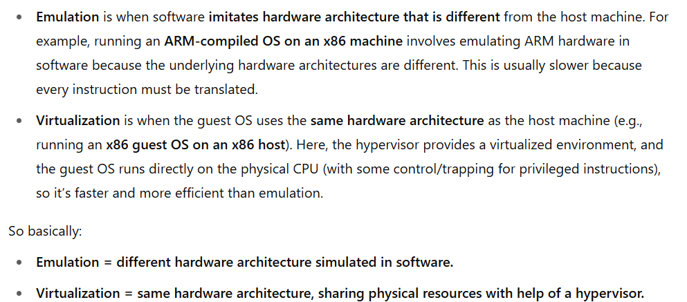
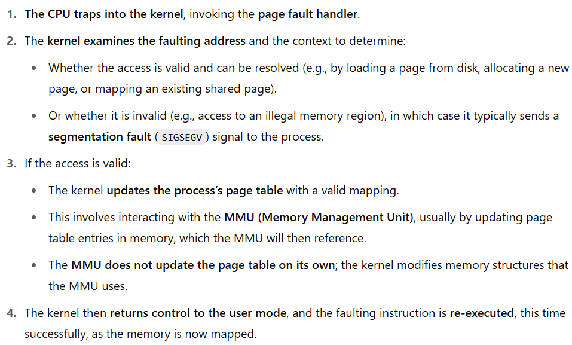
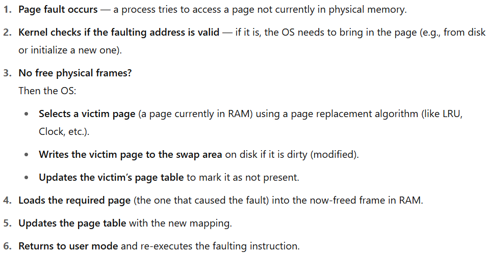

# SPL Notes

- system prog: developing apps that in-directly serves the user, or serving other apps.\
application prog: developing apps that directly serves the user.

- types of commands:
    - shell built-in: command is implemented within the shell sw.
    - user program (external command): the command is another sw/exec.

- in redicrection: 0 (stdin), 1 (stdout) and 2 (stderr) are file descriptors (fd).

- `~` represents the current user home dir.

- pipelining: the 2 commands run in parallel, meaning that the 2nd command doesn't wait until 1st command completes its work, but it operates on the output continuously. So, pipelining is a form of IPC.

- dealing with everything is a file, is a way to standardize the io operations with multiple devices (e.g. disk, uart, keyboard/monitor).

- executable file have these sections - and more:
    - .text: src code
    - .rodata: read-only data
    - .data: global initialized variables 
    - .bss: global un-initialized variables
    - .symtab: table mapping functions, global variables, symbols to their location in the exectuable.

## Definitions
- BSD: Berkley Software Distribution
- GPL: GNU Public License.
- kernel: core of an os, it's the sw that manages and allocates computer resources (cpu, ram, other devices, etc..).
- MBR: master boot record
- BOIS : basic input/output sw
- BIOS POST: Power-On Self-Test.
- ELF: executable and linkable format.
- executable format: describes how different sections are aligned/organized in the executable (that's why win exe's don't work on linux, as they have diff formats)
- Shell: a user-space application that provides a command-line interface for users to interact with the operating system. It runs in user space, not kernel space, and acts as an intermediary between the user and the OS kernel by interpreting and executing commands.
- magic numbers: are used to detemine actual type of files, they are the first few bytes in a file.
- a process is a running program in RAM.\
program is a file in hard drive.
- MMU: Memory Management unit.
- sys call: a controlled entry point to the kernel, allowing a process to request the kernel to perform some action on the process's behalf. Usually, system calls are not invoked directly: instead, most system calls have corresponding C library wrapper functions which perform the steps required (e.g., trapping to kernel mode) in order to invoke the system call.

## Booting Sequence
- BIOS is located in EEPROM.
- BIOS POST: performing a series of diagnostic checks to ensure the computer's essential hardware components are functioning correctly before the operating system loads.
- BIOS loads the first 512 bytes from the hard drive of the selected boot device (these 512 bytes are what is commonly known as the MBR) to the RAM.
- The MBR (1st-stage bootloader) is crucial for locating and loading the operating system's bootloader (2nd-stage bootloader) from hard drive to RAM.
- bootloader loads the os kernel to the RAM.
- the os kernel calls the init/systemd process.
- types of 2nd-stage bootladers:
    - GRUB: linux bl (can detect windows & linux bootable devices)
    - NTLDR: old windows verions bl (win xp, win 98)
    - BOOTMGR: windows bl (starting from win 7)

- [before calling init/systemd process] when kernel is up, it uses physical ram addresses, then it fills the page table in MMU to enable processes to work in their own virtual memory, abstracted from their physical addresses in ram.

## Virtualization
- Virtualization is a methodology of dividing the resources of a computer system into multiple execution envs.
- types of Virtualization:
    - para virtualization: bare-metal hypervisor (virtual machine monitor), calling hw directly, the guest os is modified to be aware of the virtualization environment 
    - full virtualization: the hypervisor completely emulates the underlying hardware so the guest os believes it's running on real pysical hw.
- emulation: imitates hardware architecture that is different from the host machine, and it's all done using sw (emulator), for example, to run ARM-compiled guest os on your x86 machine, this is emulation, but to run x86 guest os on your x86 os is vitualization (and it could be emulated also).

## Processes
- when a program starts executing as a process, u never know what's the process address in ram, you don't know what's free or used in it, so u can't link the process to a fixed physical ram address, that's why the processes use virtual memory/addresses.
- virtual memory: all processes take virtual address space from 0 to all f's (the whole ram address space), but the physical/real address space in ram is unknown to the process (abstracted), only the kernel and MMU know the mapping from virtual to physical addresses (page table).
- when a user process makes a system call or an interrupt/exception occurs, the cpu switches to kernel mode to handle this call/exception, and since the kernel has fixed physical address in ram, then it's rational that kernel addressess are mapped identically in all processess' virtual memories.

- page fault exception: happens when a process tries to access a virtual memory address that is not currently mapped in its page table. this triggers an exception that transfers control to the kernel. The kernel's page fault handler checks whether the access is valid. If so, it allocates or loads the appropriate page from disk, updates the process page table, and returns to user mode. The instruction that caused the fault is then re-executed, now succeeding with the valid mapping. all this happens, if there's available space in ram. here's a detailed info:

and if there's no space in ram, it uses swap area, here's the details:

- every process starts with 3 open fd's (stdin/out/err).

- when calling a process with args:
    - the shell tokenizes/parses the arguments, creates an array for them.
    - the shell asks the kernel to run process x, with arguments array y (argv).
    - the kernel runs the process x, and places the arguments (array elements) into the the process stack.

## System calls
- a kernel dispatches a syscall by number.
- syscall is NOT a funtion call, u usually use a wrapper function for the syscall.
- syscall executaion:
    - app calls a syscall wrapper function.
    - the wrapper function puts the syscall number, function parameters in registers, to pass them from user space to kernel space (max parameters is 7, arch-dependent).
    - the wrapper function triggers a sw interrupt (which is arch-dependent).
    - switch to kernel mode (privileged mode), to the trap/interrupt handler 
    - in the trap/interrupt handler, there's a syscall table (think of as array of function pointers), accessed by syscall number.
    - the -real- syscall is then executed, then return to the handler again.
    - the handler puts the return value on a register.
    - switch to user mode.
    - the wrapper function reads the syscall return value from a register.

## Commands
- `readelf`
- `file`: display type of a file.
- `find` searches in the real system, it's slower but always up-to-date.\
`locate` uses a previously built database (command updatedb), it's much faster, but uses an 'older' database and searches only names or parts of them.
- `useradd` is a low level option to add users, requiring explicit setup\
`adduser` is high level option to add users.
- `history`: view history of commands.
- `!<number>`: recall a command from history (e.g. `!-1` to recall the last command)
- `strace`: records the system calls which are called by a process and the signals which are received by a process.