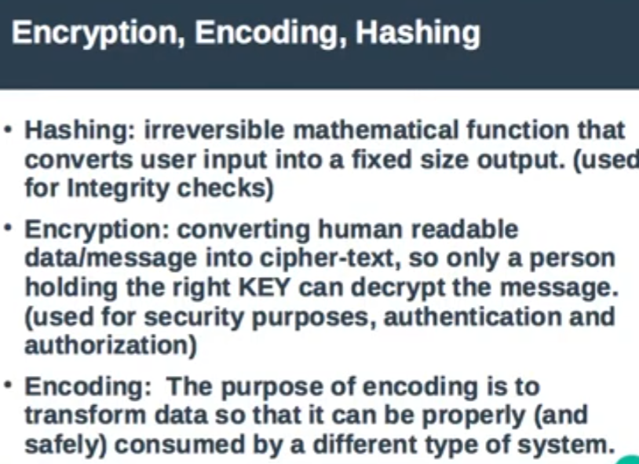
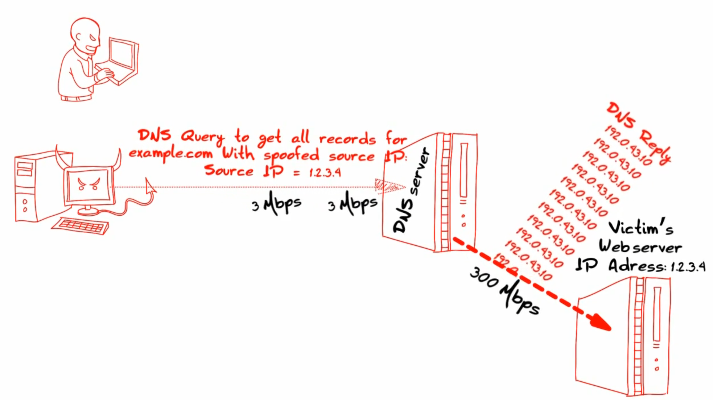

# Cyber Security Introduction

## Terms
- PoLP: Principle of Least Privilege
- Vulnerability: A weakness in a system (e.g., an unpatched software bug or a weak password).
- Threat: Anything that can exploit a vulnerability (e.g., a hacker, a virus, or even a natural disaster).
- Risk: The intersection of the two. Risk = Threat x Vulnerability.
- IAM: Identity and Access Management.
- RBAC: Role-Based Access Control
- ABAC: Attribute-Based Access Control
- DHCP: Dynamic Host Configuration Protocol
- CDN: Content Delivery Network.
- CA: Certificate Authority.
- TLS: Transport Layer Security
- MAC: Message Authentication Code
- HMAC: Hash-based MAC.
- DNS: Domain Name System.
- DDoS: Distributed Denial of Service
---
## CIA Triad
- Confidentiality: Ensuring that sensitive information is accessed only by authorized individuals. This is often achieved through encryption, access control lists (ACLs), and two-factor authentication (2FA).
- Integrity: Maintaining the consistency, accuracy, and trustworthiness of data over its entire life cycle. This ensures that data cannot be modified by unauthorized people. Common methods include digital signatures and hashing.
- Availability: Ensuring that information and resources are available to users when they need them. This involves maintaining hardware, performing regular updates, and having a plan for Disaster Recovery.
---
- PoLP dictates that a user or process should only have the minimum levels of access—or permissions—necessary to perform its job. This limits the "blast radius" if an account is compromised.

- How apps remember you: servers don't usually keep a constant "open line" to your device. Instead, they use Tokens. JWT: This is the industry standard for app security. When you log in, the server gives your app a JWT. Your app then attaches this "digital badge" to every future request so the server knows it's still you.

- CDN is a geographically distributed group of servers that caches content close to end users. A CDN allows for the quick transfer of assets needed for loading Internet content, including HTML pages, JavaScript files, stylesheets, images, and videos.

- Hashing, Encryption and Encloding

- Rainbow tables are large databases that contain pairs of plaintext passwords and their corresponding hash values.
---
## Threat Actor vs Threat Vector
Threat Actor (The "Who"): is an individual or group that performs an action with the intent to harm a digital system, network, or person. They are categorized by their motivations, resources, and level of sophistication.
- Cybercriminals: Motivated primarily by financial gain. They often use ransomware or phishing to steal data they can sell.
- State-Sponsored Actors: Highly sophisticated groups funded by governments. Their goals are usually espionage, intellectual property theft, or disrupting critical infrastructure.
- Hacktivists: Individuals who hack to promote a political agenda or social cause.
- Insiders: Employees or contractors who have legitimate access but use it maliciously (or accidentally) to cause harm.
- Script Kiddies: Less experienced individuals who use existing, pre-made tools or scripts to launch attacks, often for thrill-seeking.

Attack Vector (The "How"): is the path, route, or method used by a threat actor to gain access to a system or deliver a malicious payload. If a system is a fortress, the attack vector is the specific door, window, or tunnel the intruder uses to get inside. Common Attack Vectors:
- Phishing: Using deceptive emails or messages to trick users into revealing credentials or downloading malware.
- Unpatched Software: Exploiting known vulnerabilities in operating systems or applications that haven't been updated.

- Credential Stuffing: Using lists of leaked usernames and passwords from one breach to try and gain access to other accounts.

- Man-in-the-Middle (MitM): Intercepting communication between two parties (like on an unsecured public Wi-Fi) to steal data.

- Social Engineering: Manipulating human psychology to convince someone to hand over sensitive information or bypass security protocols.
---
## IAM
IAM is a framework of policies and technologies designed to ensure that the right people have the right access to the right resources at the right time for the right reasons.
IAM is generally broken down into four distinct processes:
- Identification: Claiming who you are (e.g., entering a username).
- Authentication (AuthN): Proving you are who you say you are (e.g., providing a password, a fingerprint, or a code from an app).
- Authorization (AuthZ): Granting or denying permission to do specific things (e.g., a junior engineer can read code, but only a senior engineer can "push" it to production).
- Accountability/Auditing: Tracking what a user did while they were logged in. This creates a "paper trail" for security reviews.

Modern IAM systems use several strategies to keep access secure yet efficient:

- Multi-Factor Authentication (MFA) requires at least two types of evidence (factors) to verify identity. These factors usually fall into three categories:
    - Something you know: A password or PIN.
    - Something you have: A physical key, a smartphone, or a hardware token.
    - Something you are: Biometrics like a fingerprint or facial recognition.
- Single Sign-On (SSO) allows a user to log in once with a single set of credentials to access multiple, independent software systems. This improves productivity and reduces "password fatigue," where users write down dozens of different passwords because they can't remember them all.
- RBAC vs. ABAC
These are the two primary ways to manage Authorization:
    - RBAC: Permissions are tied to a job title. If you are in the "Accounting" group, you automatically get access to the payroll folders.
    - ABAC: Permissions are more granular and based on context. For example: "Allow access to the server only if the user is in the 'Engineering' group and it is between 9:00 AM and 5:00 PM."
---
## HTTPS Handshake
The Asymmetric Phase (The Handshake):
- When you first connect to a website, the browser and server need to agree on a secret key without anyone else "listening in" seeing it.

- The Certificate: The server sends its Public Key to your browser via an SSL/TLS Certificate.

- Key Exchange: Using a method like Diffie-Hellman or RSA, the browser and server perform a mathematical exchange. They use the server's Public Key to securely negotiate a Session Key.

- Verification: The browser uses the certificate to verify the server is who they claim to be (e.g., that you are actually talking to google.com and not an impostor).

The Symmetric Phase (The Conversation):
Once both sides have successfully derived the Session Key, they stop using the slow asymmetric keys.

- Speed: They switch to a symmetric algorithm (usually AES). This is thousands of times faster and requires much less computational power.

- Privacy: Every packet of data sent back and forth (your credit card info, login details, or search queries) is encrypted using that shared Session Key.

- Disposability: This key is only for this specific session. If you close the browser and come back later, they will perform a new handshake and create a brand new key.

One Extra Step: Integrity (Hashing): 
To make sure a "Man-in-the-Middle" hasn't tampered with the data while it’s in transit, HTTPS also uses Hashing (specifically HMAC, which mixes the secret key with data when hashing).

Each message includes a MAC. If a single bit of the encrypted data is changed by a hacker, the hash won't match when it arrives, and the browser will immediately drop the connection and show a security warning.
---
## Attacks
### DNS Poisoning
Also known as DNS Spoofing, is a technique used to redirect users from legitimate websites to malicious ones.
How it Works:
- When you visit a website, your computer asks a DNS resolver for the IP address. To save time, resolvers "cache" (store) these addresses. In a poisoning attack, a hacker sends a fraudulent DNS response to the resolver before the real one arrives. This fake response contains a different IP address—one that leads to a server controlled by the attacker.

- The Result: The DNS resolver stores the "poisoned" entry. For a period of time, anyone using that resolver who tries to visit the legitimate site will be sent to the attacker’s fake site (often a phishing page designed to steal login credentials).

- The Danger: It is extremely difficult for a user to detect because the URL in the browser looks correct, but the underlying destination is compromised.

### DNS Amplification Attack
It's a type of Distributed Denial of Service (DDoS). Instead of stealing information, its goal is to crash a target’s server by overwhelming it with traffic.
How it Works: 
- This attack relies on two main factors: IP Spoofing and Message Size Discrepancy.

- The Request: The attacker sends a large number of small DNS queries (e.g., "Tell me everything you know about this domain") to open DNS resolvers.

- The Spoof: The attacker fakes the "return address" of these queries. Instead of the resolver sending the answer back to the attacker, the resolver sends it to the victim’s IP address.

- The Amplification: DNS queries can be very small, but the responses can be very large. A query of 60 bytes can trigger a response of over 3,000 bytes. This "amplifies" the attacker's bandwidth by a factor of 50 or more.

- The Result: The victim’s server is bombarded with massive amounts of unsolicited DNS data from hundreds of different resolvers simultaneously. This clogs their network and takes their services offline.

### DNS Subdomain Takeover
A subdomain takeover occurs when an attacker gains control over a legitimate subdomain (e.g., sub.example.com) because it points to an external service that has been decommissioned or deleted, but the DNS record remains active.

Essentially, the DNS record becomes a "pointing finger" aimed at an empty space that an attacker can quickly occupy.

How It Works: The Lifecycle of a Takeover
- Service Provisioning: A company signs up for a third-party service (like GitHub Pages, Heroku, or an AWS S3 bucket) to host content.

- DNS Configuration: The company creates a CNAME (Canonical Name) record in their DNS settings. This tells the internet: "To find blog.example.com, go look at example-company.github.io."

- Service Abandonment: Later, the company stops using the third-party service and deletes their account or project. However, they forget to delete the CNAME record in their DNS.

- The "Dangling" DNS: The DNS record is now "dangling." It still points to example-company.github.io, but that address is now available for anyone to claim.

- The Takeover: An attacker creates a new account on that same third-party service and claims the name example-company. Now, anyone visiting blog.example.com sees the attacker's content.

### TCP SYN Flood
To understand the attack, you first have to look at how a "healthy" connection is made. Normally, the process follows three steps:

- SYN (Synchronize): The client sends a request to the server.

- SYN-ACK (Synchronize-Acknowledge): The server responds and reserves a bit of memory (a "slot") to keep the connection open.

- ACK (Acknowledge): The client sends a final confirmation, and the connection is established.

The Attack Mechanism:
In a SYN Flood, the attacker skips the final step:

- The attacker sends a massive volume of SYN requests, often using a "spoofed" (fake) IP address.

- The server responds with a SYN-ACK for every single one and opens a "half-open" connection slot.

- The attacker never sends the final ACK.

Why it Drains Resources:
The drain isn't necessarily about CPU or RAM in the traditional sense; it’s about the Connection Table.

- Every operating system has a limit on how many "half-open" connections it can track at once.

- The server will wait for a timeout period (which can be 30–120 seconds) before giving up on that connection.

- By sending thousands of these requests per second, the attacker fills up the server's connection table completely.

- The Result: When a legitimate user tries to connect, the server has no "slots" left and simply drops the request. The server is still "on," but it is effectively invisible to the rest of the world.

---
## Tools
- https://haveibeenpwned.com/
- virustotal.com: get sub-domains
- dig command: get sub-domains
- nmap: scan ports
- https://www.exploit-db.com/
- metasploit

---
## Resources
- https://youtube.com/playlist?list=PLv7cogHXoVhXvHPzIl1dWtBiYUAL8baHj&si=ciuqp3a9cqxzhkl3
- Gemini :D