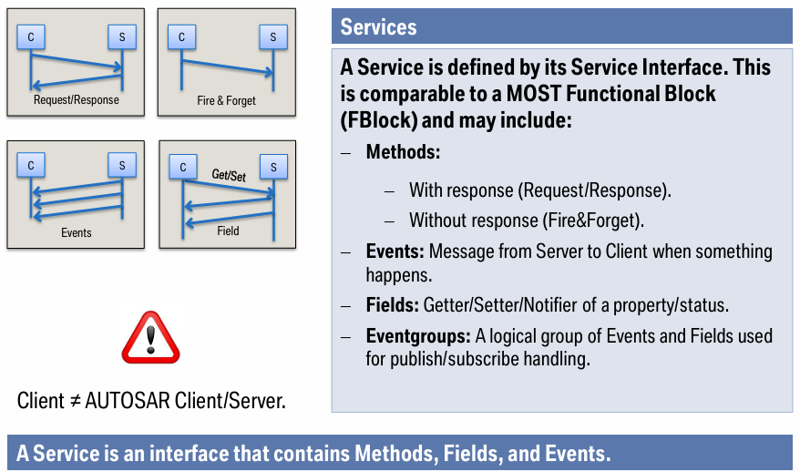
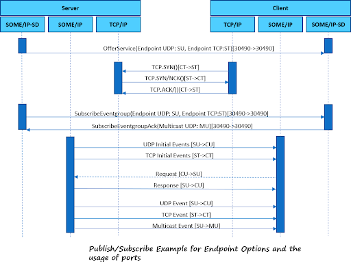

# Notes on SOME/IP

- scalable Service-Oriented MiddlewarE over IP
- it works on Ethernet.
- it's a type of RPC.
- it lets the client app to request a service from the server app, which contains the services implementations.

## IPC Methods
- Shared Memory: Processes share a common memory space for faster communication.
- Shared Files: Processes communicate by writing and reading from a common file.
- Message Queues: Processes send and receive messages through a managed queue system.
- Sockets: Processes communicate over a network or locally using socket-based communication.
- Signals: Processes send simple notifications to each other (e.g., SIGKILL, SIGTERM).

## Whats is a Service and its types
 

## What is Service Discovery (SD)?
Service Discovery in SOME/IP is a mechanism that enables:
- Automatic detection of available services.
- Dynamic registration and deregistration of services.
- Management of communication endpoints without static configuration.

This is crucial in modern automotive networks where ECUs and applications can be added or removed dynamically.

## Components of SOME/IP Service Discovery
The SOME/IP Service Discovery mechanism consists of the following key components:

### Service Instances
- A service is an application functionality that an ECU provides (e.g., a speed sensor service).
- A service instance is a specific implementation of a service on a particular ECU.

### Service IDs and Method IDs
- Each service has a Service ID (unique identifier).
- Each function within a service has a Method ID.

### Service Discovery Messages
SOME/IP SD uses multicast messages to announce services dynamically. There are two main types:
- Offer Service Message: Sent by a service provider to inform clients that a service is available.
- Find Service Message: Sent by a service consumer to search for available services.

## Service Discovery (SD) Process
The process involves three main steps:

### Service Registration
- The ECU that provides a service sends periodic Offer Service messages on a multicast address.
- These messages contain the Service ID and available methods.

### Service Request
- An ECU that requires a service sends a Find Service message to request available services.
- If a matching service is found, the provider responds.

### Service Subscription & Event Handling
- Once a service is discovered, the consumer subscribes to events (if applicable).
- The provider sends notifications or event updates based on subscription settings.

### SD Sequence Diagram

## CommonApi C++
CommonAPI C++ has 2 main components:
- CommonAPI C++ Core: it manages SD, message dispatching, and connection handling.
- CommonAPI C++ Binding (Runtime): it connects the services defined to a specific transport layer (it provides an abstraction layer as CommonAPI supports both SOME/IP and D-BUS, that's why it's connected to a generic name "IPC Stack").

## Franca IDL specs file
Contains the interface definitions used to describe services, methods, events, and data structures for communication between applications.
The .fidl file is passed to a code generation tool that generates .hpp and .cpp code, used by CommonAPI C++ and SOME/IP protocol. 

## SOME/IP Proxy
Benefits of using a proxy in SOME/IP:
1. Decoupling Clients and Services:
The client does not need to know the exact location of the service. The proxy abstracts the service location, improving flexibility and scalability.

2. Security and Access Control:
A proxy can enforce security policies, such as authentication and authorization, before forwarding messages to the actual service.

3. Error Handling & Fault Tolerance:
If a direct service is unavailable, the proxy can reroute requests to backup services or provide fallback responses.

4. SD Assistance:
Proxy helps relay SD messages between different network domains or ECUs, to ensure that services in separate network segments can find and communicate with each other.